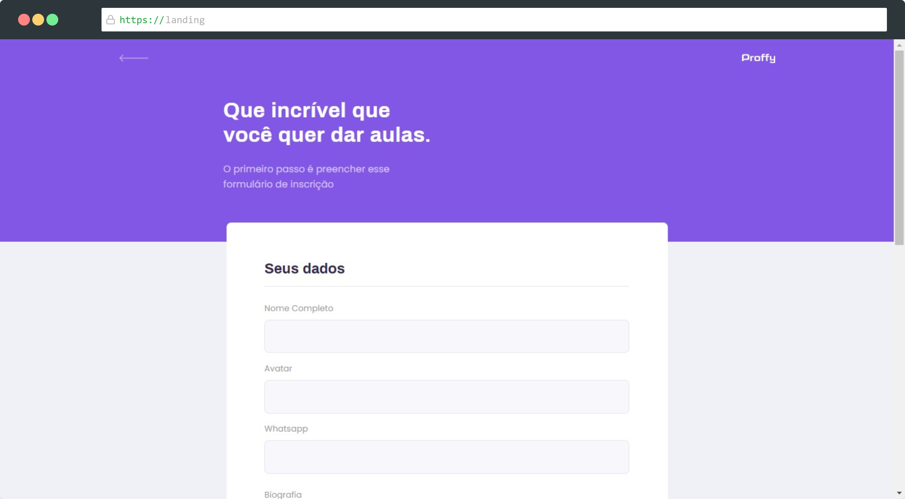
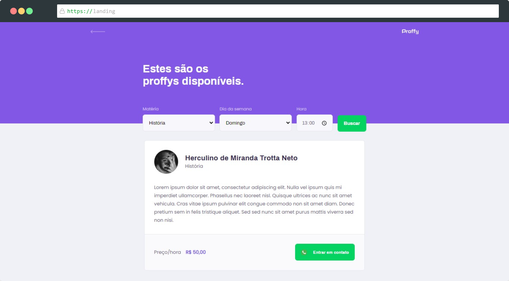

<div align="center">
  </img>
</div>

<h1 align="center">Proffy</h1>
<p align="center">Online platform to connect students and teachers</p>
<div align="center">
  <sub>:rocket: Made as a learning exercise during the "Next Level Week #2" hosted by @Rocketseat.</sub>
</div>

<br />

<div align="center">
  <a href="https://github.com/eitchtee/proffy/blob/master/LICENSE" target="_blank"></a>
</div>

----

<p align="center">
    <a href="#screenshots">📸 Screenshots</a> • <a href="#running">👷 Running</a>
</p>

## Screenshots

### Web
</img> </img> </img>

## Running

### Requirements
* [Node.js](https://nodejs.org/en-url)
* [Yarn](https://classic.yarnpkg.com/)
* [Expo](https://expo.io/)

### Clone
```bash
$ git clone https://github.com/eitchtee/Proffy.git
```

### API

Go to `server` folder
```bash
$ cd Proffy/server
```

Install dependencies
```bash
$ yarn install
```

Migrate the database
```bash
$ yarn knex:migrate
```

Run server
```bash
$ yarn start
```
> The API will be exposed on http://localhost:3333/

### Web

Go to `web` folder
```bash
$ cd Proffy/web
```

Install dependencies
```bash
$ yarn install
```

Start live server
```bash
# Run Aplication
$ yarn start
```
> Go to http://localhost:3000/